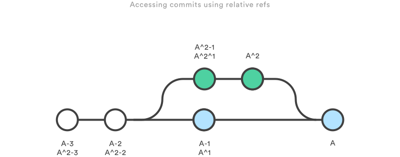

# Git references and reflogs

Git is all about commits: you stage commits, create commits, view old commits, and transfer commits between repositories using many different Git commands. The majority of these commands operate on a commit in some form or another, and many of them accept a commit reference as a parameter.

### Hashes
The most direct way to reference a commit is via its SHA-1 hash. This acts as the unique ID for each commit. You can find the hash of all your commits in the git log output. When passing the commit to other Git commands, you only need to specify enough characters to uniquely identify the commit. 

### Refs
A ref is an indirect way of referring to a commit. You can think of it as a user-friendly alias for a commit hash. This is Git’s internal mechanism of representing branches and tags. Refs are stored as normal text files in the .git/refs directory. You should see the following structure, but it will contain different files depending on what branches, tags, and remotes you have in your repo:

```markdown
.git/refs/
heads/
master
some-feature
remotes/
origin/
master
tags/
```

The heads directory defines all of the local branches in your repository. Each filename matches the name of the corresponding branch, and inside the file you’ll find a commit hash. 

### Packed Refs
For large repositories, Git will periodically perform a garbage collection to remove unnecessary objects and compress refs into a single file for more efficient performance. You can force this compression with the garbage collection command: `git gc`

This moves all of the individual branch and tag files in the refs folder into a single file called packed-refs located in the top of the .git directory. If you open up this file, you’ll find a mapping of commit hashes to refs. 

### Special Refs
In addition to the refs directory, there are a few special refs that reside in the top-level .git directory. They are listed below:

- HEAD – The currently checked-out commit/branch.
- FETCH_HEAD – The most recently fetched branch from a remote repo.
- ORIG_HEAD – A backup reference to HEAD before drastic changes to it.
- MERGE_HEAD – The commit(s) that you’re merging into the current branch with git merge.
- CHERRY_PICK_HEAD – The commit that you’re cherry-picking.

These refs are all created and updated by Git when necessary.

### Refspecs
A refspec maps a branch in the local repository to a branch in a remote repository. This makes it possible to manage remote branches using local Git commands and to configure some advanced git push and git fetch behavior. Refspecs can be used with the git push command to give a different name to the remote branch. 

### Relative Refs
You can also refer to commits relative to another commit. The ~ character lets you reach parent commits. For example, the following displays the grandparent of HEAD: `git show HEAD~2`. But, when working with merge commits, things get a little more complicated. Since merge commits have more than one parent, there is more than one path that you can follow.The ~ character will always follow the first parent of a merge commit. If you want to follow a different parent, you need to specify which one with the ^ character. The following figure should give a better understanding



### The Reflog
The reflog is Git’s safety net. It records almost every change you make in your repository, regardless of whether you committed a snapshot or not. You can think of it as a chronological history of everything you’ve done in your local repo. 

You can use this to revert to a state that would otherwise be lost. For example, lets say you just scrapped a new feature with git reset. Your reflog might look something like this:
```markdown
ad8621a HEAD@{0}: reset: moving to HEAD~3
298eb9f HEAD@{1}: commit: Some other commit message
bbe9012 HEAD@{2}: commit: Continue the feature
9cb79fa HEAD@{3}: commit: Start a new feature
```

The three commits before the git reset are now dangling, which means that there is no way to reference them—except through the reflog. Now, let’s say you realize that you shouldn’t have thrown away all of your work. All you have to do is check out the HEAD@{1} commit to get back to the state of your repository before you ran git reset.