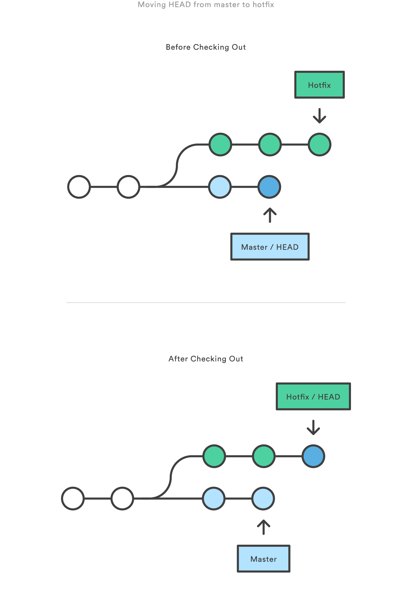

# Revert, Reset and checkout

The git reset, git checkout, and git revert commands are very useful and often there is a lot of confusion regarding them because they are so similar. 

A checkout is an operation that moves the HEAD ref pointer to a specified commit. Lets assume the following structure and the HEAD ref and master branch ref currently point to commit d. 

Now let us execute `git checkout b`.

A revert is an operation that takes a specified commit and creates a new commit which inverses the specified commit. git revert can only be run at a commit level scope and has no file level functionality. A reset is an operation that takes a specified commit and resets it to match the state of the repository at that specified commit. 

Checkout and reset are generally used for making local or private 'undos'. They modify the history of a repository that can cause conflicts when pushing to remote shared repositories. Revert is considered a safe operation for 'public undos' as it creates new history which can be shared remotely and doesn't overwrite history remote team members may be dependent on. 

### Reset A Specific Commit
On the commit-level, resetting is a way to move the tip of a branch to a different commit. This can be used to remove commits from the current branch.

The two commits that were on the end of hotfix are now dangling, or orphaned commits. This usage of git reset is a simple way to undo changes that haven’t been shared with anyone else. It’s your go-to command when you’ve started working on a feature and then you realise what the hell you have been doing and want to start fresh. In addition to moving the current branch, you can also get git reset to alter the staged snapshot and/or the working directory by passing it one of the following flags:

- --soft – The staged snapshot and working directory are not altered in any way.
- --mixed – The staged snapshot is updated to match the specified commit, but the working directory is not affected. This is the default option.
- --hard – The staged snapshot and the working directory are both updated to match the specified commit.

### Checkout old commits
The git checkout command is used to update the state of the repository to a specific point in the projects history.  All the above command does is move HEAD to a different branch/commit and update the working directory to match. Since this has the potential to overwrite local changes, Git forces you to commit or stash any changes in the working directory that will be lost during the checkout operation. Unlike git reset, git checkout doesn’t move any branches around.

This is useful for quickly inspecting an old version of your project. However, since there is no branch reference to the current HEAD, this puts you in a detached HEAD state. This can be dangerous if you start adding new commits because there will be no way to get back to them after you switch to another branch. For this reason, you should always create a new branch before adding commits to a detached HEAD.

### Undo Commits with Revert
Reverting undoes a commit by creating a new commit. This is a safe way to undo changes, as it has no chance of re-writing the commit history. For example, the following figure shows that the the changes contained in the 2nd to last commit is used to create a new commit undoing to those changes. 

Since git revert creates a new commit and does not alter the commit history, git revert should be used to undo changes on a public branch, and git reset should be reserved for undoing changes on a private branch. You can also think of git revert as a tool for undoing committed changes, while git reset HEAD is for undoing uncommitted changes.

